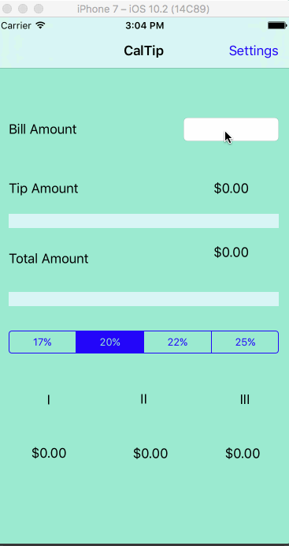

# CodePath-CalTip
This is a Tip Calculator application for iOS submitted as the pre-assignment requirement for Codepath.

Time spent: 6 hours

Completed Tasks:

* [x] Required: User can enter a bill amount, choose a tip percentage, and see the tip and total values.
* [x] Required: Settings page to change the default tip percentage.
* [x] Optional: Bill Amount Calculted for 1-3 persons, in case the total amount is split.

Notes:

This app only works best on "iPhone 7" potrait mode.
UI not optimized for other screens..
